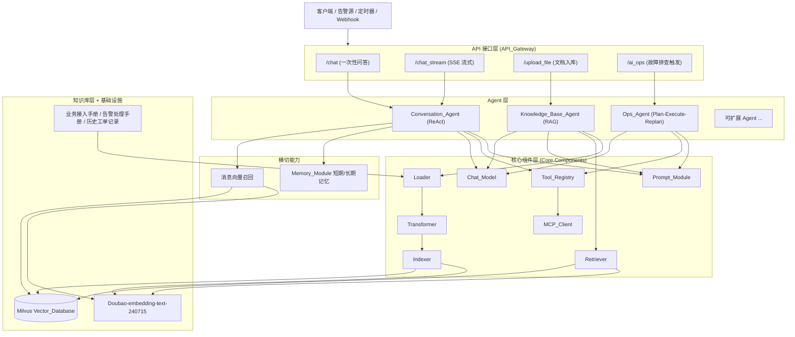
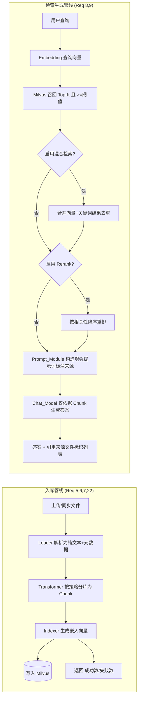
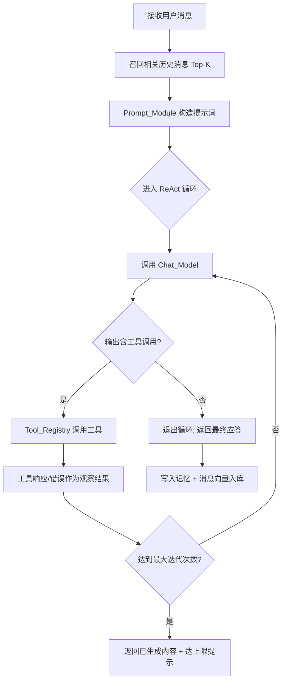
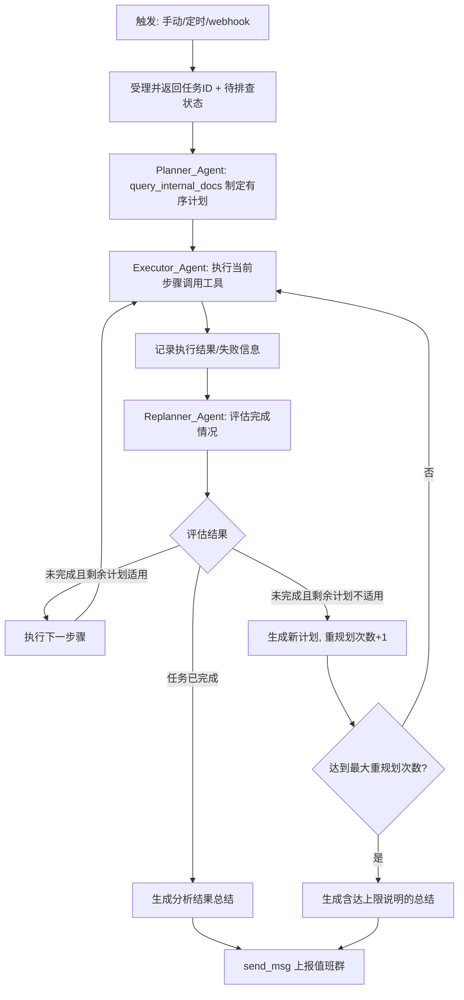

# Design Document

## Overview

本设计文档描述企业级智能 OnCall Agent（"Ghost Agent"）的技术方案。系统以分层架构整合三大核心 Agent 能力（知识库 Agent / 对话 Agent / 运维 Agent），对外提供 `/chat`、`/chat_stream`、`/upload_file`、`/ai_ops` 四个接口，实现"问题自动应答"与"故障智能排查"一体化运维服务。

设计遵循以下原则：

- **语言无关架构（Language-agnostic）**：核心架构、组件契约、数据模型与正确性属性均以语言无关方式描述，再通过映射表落地到 Python（FastAPI + LangChain + LangGraph）、Go（Goframe + Eino）、Java（SpringBoot + Spring AI Alibaba）三套技术栈。三套实现对相同合法请求返回功能等价的可观测应答（Req 23.5）。
- **分层解耦**：API 接口层、Agent 层、核心组件层、知识库层、横切能力层职责清晰，便于扩展新 Agent 与新工具。
- **统一基础设施**：所有技术栈统一使用 Milvus 作为 `Vector_Database`、Doubao-embedding-text-240715 作为 `Embedding_Model`（Req 21、Req 23.4）。
- **可测试性优先**：核心逻辑（分片、索引计数、检索召回、记忆隔离、重规划计数、工具参数校验、序列化）以纯函数/确定性接口建模，支持属性化测试（Property-Based Testing）。

### 需求映射概览

| 设计区域 | 覆盖需求 |
|---|---|
| API_Gateway（接口层） | Req 1, 2, 3, 4 |
| Knowledge_Base_Agent（RAG 入库 + 检索 + 生成 + 同步） | Req 5, 6, 7, 8, 9, 22 |
| Conversation_Agent（ReAct） | Req 10 |
| Ops_Agent（Plan-Execute-Replan + 上报 + 触发） | Req 11, 12, 13, 14, 15 |
| Tool_Registry / MCP_Client | Req 16, 17 |
| Memory_Module / 消息向量召回 | Req 18, 19 |
| Prompt_Module | Req 20 |
| Vector_Database / Embedding_Model | Req 21 |
| 技术栈实现选项 | Req 23 |

## Architecture

### 高层分层架构

系统自上而下分为五层，横切能力贯穿各层。



### 技术栈映射表

架构组件在三套技术栈中的落地映射（Req 23.1–23.4）：

| 架构概念 | Python (FastAPI + LangChain + LangGraph) | Go (Goframe + Eino) | Java (SpringBoot + Spring AI Alibaba) |
|---|---|---|---|
| API 接口层 | FastAPI Router + StreamingResponse(SSE) | Goframe ghttp Server + SSE Writer | SpringBoot WebFlux Controller + SseEmitter |
| Agent 编排 | LangGraph StateGraph | Eino Graph/Chain | Spring AI Alibaba Graph |
| ReAct 循环 | LangGraph create_react_agent | Eino ReAct Agent | Spring AI Alibaba ReActAgent |
| Plan-Execute-Replan | LangGraph 自定义多节点图 | Eino 多 Agent 编排 | Spring AI Alibaba 多 Agent 编排 |
| Chat_Model | LangChain ChatModel | Eino ChatModel | Spring AI ChatClient |
| 文档加载/分片 | LangChain DocumentLoader / TextSplitter | Eino Document Loader / Transformer | Spring AI DocumentReader / Splitter |
| 向量库客户端 | pymilvus | milvus-sdk-go | milvus-sdk-java |
| Embedding | Doubao(volcengine) SDK | Doubao SDK | Spring AI EmbeddingModel + Doubao |
| 工具调用 | LangChain Tools / bind_tools | Eino Tool | Spring AI FunctionCallback |
| MCP 客户端 | mcp (python sdk) | mcp-go | Spring AI MCP Client |
| 记忆 | LangGraph Checkpointer / 自研 | Eino Memory / 自研 | Spring AI ChatMemory |

> 部署约束：单次部署仅启用三种技术栈中的一种（Req 23.6）；部署配置指定的技术栈不在 {Python, Go, Java} 之内时拒绝启动并返回不支持错误（Req 23.7）。

### RAG 入库与检索流程

文档入库管线（Loader → Transformer → Indexer → Milvus）与检索生成管线（query → embedding → recall → rerank/hybrid → 增强提示词 → 生成）：



### ReAct 循环流程（Conversation_Agent）



### Plan-Execute-Replan 流程（Ops_Agent）



## Components and Interfaces

本节以语言无关的接口契约（伪签名）描述各组件职责、输入/输出与关键约束。所有接口的具体类型与错误对象会按技术栈映射表落地。

### API 接口层（API_Gateway）

职责：请求路由、入参校验、会话管理、超时控制、SSE 事件协议。覆盖 Req 1–4。

#### `/chat`（一次性问答，Req 1）

```
POST /chat
Request:  { session_id?: string, message: string }
Response: 200 { session_id: string, answer: string }
          400 { error_code, message }   // 缺失/空消息(1.3) 或 超长(>8000, 1.6)
          504 { error_code, message }    // 处理超时 60s (1.5)
          5xx { error_code, message }    // 生成错误 (1.7)
```

- 校验顺序：先校验 `message` 存在且 `trim` 后非空（1.3），再校验长度 ≤ 8000（1.6）。校验不通过时不路由至 Conversation_Agent。
- 缺失 `session_id` 时生成新会话标识并在响应回传（1.4）。
- 校验通过后路由至 `Conversation_Agent.handle(session_id, message)`（1.1），以单次 HTTP 响应返回完整应答与 `session_id`（1.2）。
- 自路由起计时，达到 60s 未返回则返回 504 且保留会话上下文不变（1.5）；Agent 返回生成错误时返回错误响应且保留会话上下文不变（1.7）。

#### `/chat_stream`（SSE 流式问答，Req 2）

```
POST /chat_stream  (Accept: text/event-stream)
SSE 事件协议:
  event: session   data: { session_id }            // 首事件回传会话标识 (2.7)
  event: delta      data: { text }                  // 内容增量, 按生成顺序 (2.2)
  event: done       data: { finish_reason }         // 流结束 (2.3)
  event: error      data: { error_code, message }   // 生成失败(2.5)/空闲超时(2.8)
```

- 入参校验同 `/chat`：缺失/空消息返回 400 且不建立 SSE 连接（2.6）。
- 建立 SSE 单向连接（2.1）；增量内容按生成先后顺序作为独立 `delta` 事件依次推送（2.2）；全部生成完成后发送 `done` 并关闭连接（2.3）。
- 客户端断开时停止生成并释放关联资源（2.4）。
- Chat_Model 返回错误时停止推送、发送 `error` 事件并关闭连接，不撤回已推送内容（2.5）。
- 空闲超时（默认 30s 未产生新增量）发送空闲超时 `error` 事件并关闭连接（2.8）。

#### `/upload_file`（文档入库，Req 3）

```
POST /upload_file  (multipart/form-data)
Request:  file (binary), meta?: {...}
Response: 202 { task_id: string, status: "PENDING" }   // 受理 (3.1, 3.2)
          400 { error } // 无文件或空文件(3.3)
          415 { error, supported_types: [...] } // 类型不支持(3.4)
          413 { error, max_size_bytes } // 超过大小上限(3.5)
GET /upload_file/{task_id}
Response: 200 { task_id, status, chunk_count?, failure_reason? }  // (3.6, 3.7)
```

- 校验顺序：文件存在且非空（3.3）→ 文档类型受支持（3.4）→ 文件大小 ≤ 上限（3.5）。任一不通过则不入库。
- 校验通过移交 `Knowledge_Base_Agent.ingest(file, meta)` 并返回唯一 `task_id` 与初始状态（3.1, 3.2）。
- 入库成功将任务状态置为 `COMPLETED` 并提供 `chunk_count`（3.6）；失败置为 `FAILED` 并提供 `failure_reason`（3.7）。

#### `/ai_ops`（故障排查触发，Req 4）

```
POST /ai_ops
Request:  { trigger_type: "manual"|"scheduled"|"webhook", alarm: {...}, target: string, signature?: string }
Response: 202 { task_id, status: "ACCEPTED" }   // 5s 内受理 (4.2)
          400 { error } // 缺告警信息或排查目标 (4.3)
          401 { error } // webhook 签名校验失败 (4.5)
          503 { error } // 不可用或并发达上限 (4.6)
```

- 接收触发请求后路由至 `Ops_Agent.start(trigger)`（4.1），5s 内返回唯一 `task_id` 与"已受理待排查"状态（4.2）。
- 缺少告警信息或排查目标返回 400 且不创建任务（4.3）。
- `trigger_type=webhook` 时先校验来源签名，通过才启动（4.4）；签名校验失败返回 401（4.5）。
- Ops_Agent 不可用或并发达上限返回 503（4.6）。

### 核心组件层

#### Loader（加载器，Req 5）

```
Loader.parse(file, fileMeta) -> ParseResult | ParseError
  ParseResult: { text: string, sections: Section[], meta: FileMeta }
  Section: { title: string, level: int, paragraphs: string[] }
```

- 支持的文档类型集合内的文件解析为统一纯文本表示（5.1）；保留标题层级顺序与段落归属（5.2）。
- 解析失败/解析超时/内容为空时终止、不移交 Transformer、返回对应错误并将入库任务标记为失败（5.3, 5.5, 5.6）。
- 成功时将解析结果连同至少含来源文件标识、文件名、文件格式的元数据移交 Transformer（5.4）。

#### Transformer（转换器/分片，Req 6）

```
Transformer.split(parseResult, strategy?) -> Chunk[] | SplitError
  strategy ∈ { BY_HEADING, BY_PARAGRAPH, BY_SEMANTIC }  // 默认取配置 (6.2)
```

- 将非空内容按生效策略切分为一个或多个 Chunk；除最后一个外，每个 Chunk 长度介于 [minLen, maxLen]（6.1）。
- 为每个 Chunk 附加来源文件标识、顺序序号、源文档起止位置（6.3）。
- 单个 Chunk 超过 Embedding_Model 最大输入长度时进一步切分为不超过该长度的子 Chunk（6.4）。
- 完成后将 Chunk 集合移交 Indexer（6.5）；内容为空则不生成 Chunk、不移交（6.6）；策略不可应用则终止并返回错误（6.7）。

#### Indexer（索引器/嵌入，Req 7, 19）

```
Indexer.index(chunks) -> { success_count: int, failure_count: int, failures: Failure[] }
Indexer.indexMessage(sessionId, userMsg, answer) -> void (失败仅记录, 不中断, 19.2)
```

- 为每个 Chunk 调用 Embedding_Model 生成向量（7.1），成功则将文本+向量+元数据写入 Milvus（7.2）。
- 嵌入失败按配置最大重试次数重试（0–5 次，默认 3，7.3）；达上限仍失败或写入失败则记录失败、计入失败数并继续处理其余 Chunk（7.4）。
- 完成后返回成功数与失败数，且 `success_count + failure_count == 接收到的 Chunk 总数`（7.5）；空集合不调用 Embedding_Model 并返回 (0, 0)（7.6）。
- 对话轮次完成后为用户消息与应答生成向量并连同 Session 标识写入 Milvus（19.1）。

#### Retriever（检索器，Req 8, 19）

```
Retriever.retrieve(query, opts) -> Chunk[] | RetrieveError
  opts: { topK, minScore, hybrid?: bool, rerank?: bool, sessionScope?: sessionId }
```

- 非空查询转换为查询向量（8.1）；从 Milvus 召回相似度 ≥ minScore 且最高的 Chunk，数量 ≤ Top-K（1–100，默认 5，8.2）。
- Top-K 边界处存在相似度相等的 Chunk 时全部返回，可超过 Top-K（8.3）。
- 启用 Hybrid_Retrieval 时合并向量+关键词结果、去重、按融合分数降序、返回 ≤ Top-K（8.4）；启用 Rerank 时按相关性降序重排返回（8.5）。
- 无满足阈值结果返回空集（8.6）；查询为空/trim 后为空返回错误（8.7）；查询向量生成失败终止并返回错误（8.8）。
- 消息召回：限定当前 Session 范围召回相似度最高的历史消息，数量由 Top-K 决定（19.4）；无可召回历史消息返回空集（19.5）。

#### Chat_Model（对话模型）

```
ChatModel.generate(prompt, opts) -> Completion | ModelError
ChatModel.stream(prompt, opts) -> AsyncStream<Delta> | ModelError
```

底层 LLM 接口，统一封装一次性生成与流式生成，支持工具调用（Function Call）输出结构。超时与错误向调用方透传，由上层 Agent 决定处理策略。

#### Prompt_Module（提示词模块，Req 9, 20）

```
Prompt_Module.build(templateName, vars) -> Prompt | TemplateError
```

- 提示词包含角色定义与任务目标（20.1）、输出结构与格式约束说明（20.3）；模板标注需分步推理时加入分步思考指令（20.2）。
- 以唯一名称管理模板，支持不改 Agent 调用代码更新/替换同名模板（20.4）；引用的具名模板不存在时停止构造并返回缺失模板名错误（20.5）。
- RAG 增强提示词：将用户查询与召回集合全部 Chunk 构造为单条提示词并标注每个 Chunk 来源文件标识（9.1）。

#### Tool_Registry（工具集，Req 16）

```
Tool_Registry.register(toolDef) -> void | ConflictError
Tool_Registry.invoke(name, params) -> ToolResponse | ValidationError | NotFoundError
  ToolDef: { name (唯一), params: ParamDef[], description }
  ParamDef: { name, type, required }
```

- 为每个工具维护唯一名称、参数定义（名称/类型/是否必填）与功能描述（16.1）。
- 调用时按参数定义校验类型与必填（16.2）；不符合则拒绝、不执行并返回具体不符合项（16.3）。
- 提供内置工具 query_internal_docs、query_cls_log、query_prometheus_alarm、send_msg（16.4）。
- 工具存在且参数通过校验则执行并返回响应（16.5）；工具名不存在则拒绝并返回不存在错误（16.6）。

#### MCP_Client（MCP 客户端，Req 17）

```
MCP_Client.connect(server) -> ToolDef[] | ConnectError
MCP_Client.invoke(name, params) -> ToolResponse | McpError | TimeoutError
```

- 连接成功后获取工具清单并将每个工具的名称/参数定义/功能描述注册到 Tool_Registry（17.1）；调用时通过 MCP 协议转发并回传响应（17.2）。
- 工具名与已注册工具冲突则拒绝注册、记录冲突信息、保留已注册同名工具不变（17.3）。
- 连接失败则记录、不注册任何该服务端工具、不影响内置工具可用性（17.4）。
- MCP 工具返回错误响应则终止调用并返回执行失败错误（17.5）；调用超时则终止、返回超时错误且不影响其余工具可用性（17.6）。

### Agent 层

#### Knowledge_Base_Agent（RAG，Req 5–9, 22）

编排 Loader → Transformer → Indexer 入库管线与 Retriever → Prompt_Module → Chat_Model 检索生成管线，并提供知识库同步能力：

```
KBA.ingest(file, meta) -> IngestResult
KBA.answer(query) -> { answer, cited_sources: string[] }
KBA.sync(file) -> { status, success_count, failure_count }   // 22.1,22.4
KBA.remove(sourceFileId) -> { deleted_count }                 // 22.3
```

- 获得非空召回集合后构造增强提示词并要求 Chat_Model 仅依据 Chunk 生成答案（9.1, 9.2）；召回为空时明确告知未检索到相关内容且不臆造（9.3）；答案附引用来源文件标识列表（9.4）；生成错误/超时终止并返回错误，不返回部分或臆造答案（9.5, 9.6）。
- 同步：执行加载→分片→嵌入→写入完整流程并为每个 Chunk 附来源文件标识（22.1）；同源文件再次同步时以来源文件标识为依据用新 Chunk 替换旧 Chunk 且不残留旧 Chunk（22.2）；移除某来源文件删除其全部 Chunk 并返回删除数量（22.3）；返回同步状态与成功/失败 Chunk 数（22.4）；任一阶段失败终止、记录失败阶段与原因并保持已有 Chunk 不变（22.5）；移除不存在的来源文件不删除任何 Chunk 并返回不存在提示（22.6）。

#### Conversation_Agent（ReAct，Req 10, 18, 19）

```
CA.handle(sessionId, message) -> { answer } | GenerateError
```

- 构造提示词时包含从 Milvus 召回的相关历史消息，数量由历史消息 Top-K 决定（1–50，10.1）；构造完成进入 ReAct 循环并发送给 Chat_Model（10.2）。
- 输出含工具调用请求时从 Tool_Registry 调用对应工具并将响应作为新观察结果送回模型继续循环（10.3）；输出不再含工具调用时退出循环并返回最终内容（10.4）。
- 迭代次数达上限（默认 10，范围 1–50）终止并返回已生成内容 + 达上限提示（10.5）。
- 工具返回错误或工具调用超时（默认 30s，范围 1–300s）终止该次调用并将失败原因作为观察结果送回模型，由模型决定后续（10.6）。
- 循环中模型返回错误或模型调用超时（默认 60s，范围 1–120s）终止循环、保留本轮已生成内容并返回应答失败错误（10.7）。

#### Ops_Agent（Plan-Execute-Replan，多 Agent，Req 11–15）

由 Planner_Agent、Executor_Agent、Replanner_Agent 三个子 Agent 组成多 Agent 协作循环：

```
Planner_Agent.plan(alarm) -> Plan { steps: Step[], grounded: bool }   // Req 11
Executor_Agent.execute(step) -> StepResult | StepFailure                // Req 12
Replanner_Agent.evaluate(plan, stepResult) -> { verdict, newPlan?, replanCount } // Req 13
Ops_Agent.report(summary) -> ReportStatus                               // Req 14
```

- Planner：启动后调用 query_internal_docs 查询相关处理步骤（11.1）；生成有序步骤计划，步骤数 1..maxSteps（11.2）；每步标注待调用工具（取自 Tool_Registry）与目标（11.3）；未返回步骤或调用失败/超时则生成通用计划并标注无手册依据（11.4, 11.5）；完成后移交 Executor（11.6）。
- Executor：从第一步开始按标注顺序每次执行一步（12.1）；调用步骤标注的工具（来自 Tool_Registry，含 query_cls_log、query_prometheus_alarm、send_msg 与 MCP 工具，12.2）；成功记录含步骤标识与响应内容的结果并移交 Replanner（12.3）；失败记录含步骤标识与原因的失败信息、暂停后续步骤并移交 Replanner（12.4）；工具调用超时判定为该步骤失败（12.5）。
- Replanner：输出三态评估之一（任务已完成 / 未完成且剩余计划仍适用 / 未完成且剩余计划不再适用，13.1）；已完成则终止并基于已执行结果生成总结（13.2）；仍适用则指示执行下一步（13.3）；不再适用则生成新计划、重规划次数 +1、从新计划第一步执行（13.4）；重规划次数达上限（默认 10，范围 1–50）终止并生成含"因达上限未完成"说明的总结（13.5）；评估/生成新计划中模型返回错误则终止、保留已执行结果并生成含失败原因说明的总结（13.6）。
- 上报：生成总结后在配置上报时限内调用 send_msg 发送到目标群组（14.1）；总结含根因分析、处理建议、已执行操作记录三部分，无内容部分以明确无内容说明标注（14.2）；发送失败按配置间隔重试且不超过最大重试次数（14.3）；达上限仍失败记录失败信息并在保留期限内保留总结（14.4）；成功记录上报状态与发送时间并标记已上报（14.5）；目标群组未配置/不存在则跳过发送、记录错误并保留总结（14.6）。
- 触发：手动/定时/webhook（签名校验通过）均可启动（15.1, 15.2, 15.3）；缺告警信息或排查目标则拒绝并返回缺失字段错误（15.4）；同一排查目标已有进行中流程时不启动新流程并返回指向已有任务标识的提示（15.5）。

### 横切能力

#### Memory_Module（记忆模块，Req 18）

```
Memory.append(sessionId, userMsg, answer) -> void
Memory.load(sessionId) -> { shortTerm: Message[], longTerm: Summary[] }
```

- 一轮应答完成后将本轮用户消息与应答按时间顺序追加写入对应 Session 的 Short_Term_Memory（18.1）。
- 短期记忆消息数超过保留条数上限（≥1 正整数）时将超出上限的较早消息总结后写入 Long_Term_Memory（18.2），并从短期记忆移除已总结的较早消息使其数量不超过上限（18.3）。
- 总结或写入长期记忆失败时将相关消息保留在短期记忆并记录失败（18.4）。
- 为某 Session 构造提示词时按时间顺序提供短期记忆与长期记忆内容（18.5）。
- 每个 Session 记忆内容仅来源于且仅作用于该 Session，不同 Session 间相互隔离（18.6）。

#### 消息向量召回（Req 19）

由 Indexer 与 Retriever 在 Session 范围内协作：轮次完成后写入消息向量（19.1，失败仅记录不中断 19.2），构造提示词时将当前用户消息转为查询向量（19.3）并在当前 Session 范围召回最相关历史消息（19.4），无历史消息返回空集（19.5）。

### 知识库层与基础设施（Req 21, 22）

- Milvus 作为唯一 Vector_Database，统一存储文档分片向量与消息向量（21.1）；Doubao-embedding-text-240715 作为唯一 Embedding_Model（21.2）。
- 写入向量时同时存储原始文本、来源标识与向量类型（文档分片向量/消息向量，21.3）；写入向量维度与 Embedding_Model 输出维度不一致则拒绝写入并返回维度不一致错误（21.4）；连接超时返回向量库不可用错误并保留未写入数据不丢失（21.5）。
- 知识库内容：业务接入手册、告警处理手册、历史工单记录同步至 Milvus（22）。

## Data Models

数据模型以语言无关的结构描述，字段类型在各技术栈中映射为相应原生类型。所有需要持久化为向量的实体最终落地为 Milvus collection 记录。

### Chunk（文档分片，Req 6, 7, 22）

```
Chunk {
  chunk_id: string            // 全局唯一
  source_file_id: string      // 来源文件标识 (6.3, 22.1)
  seq: int                    // 在源文档中的顺序序号 (6.3)
  start_offset: int           // 在源文档中的起始位置 (6.3)
  end_offset: int             // 在源文档中的结束位置 (6.3)
  text: string                // 分片文本 (length 受 [minLen, maxLen] 约束, 6.1)
  parent_chunk_id?: string    // 若由超长 Chunk 二次切分产生 (6.4)
}
约束: 除最后一个 Chunk 外, minLen <= len(text) <= maxLen (6.1)
      len(text) <= EmbeddingModel.maxInputLen (6.4)
      start_offset <= end_offset
```

### VectorRecord（向量记录，Milvus，Req 21, 19）

```
VectorRecord {
  id: string
  vector: float[dim]          // dim == EmbeddingModel 输出维度 (21.4)
  text: string                // 原始文本 (21.3)
  source_id: string           // 来源标识: source_file_id 或 session_id (21.3)
  vector_type: enum { DOC_CHUNK, MESSAGE }   // 向量类型 (21.3)
  metadata: map<string, any>  // 文档: seq/offset; 消息: role/timestamp
}
约束: len(vector) == EmbeddingModel.dim, 否则拒绝写入 (21.4)
```

### Session 与 Memory（会话与记忆，Req 18）

```
Session {
  session_id: string          // 唯一会话标识
  created_at: timestamp
}

Message {
  message_id: string
  session_id: string          // 记忆隔离的归属键 (18.6)
  role: enum { USER, ASSISTANT }
  content: string
  created_at: timestamp        // 用于按时间先后排序 (18.1, 18.5)
}

ShortTermMemory {
  session_id: string
  messages: Message[]          // 按 created_at 升序; 数量 <= retentionLimit (18.3)
}

LongTermSummary {
  session_id: string
  summary_text: string         // 较早消息总结 (18.2)
  covered_message_ids: string[]
  created_at: timestamp
}
约束: 任一 ShortTermMemory/LongTermSummary 的 session_id 唯一确定其归属 (18.6)
      len(ShortTermMemory.messages) <= retentionLimit (retentionLimit >= 1) (18.2, 18.3)
```

### IngestTask（入库任务，Req 3, 5）

```
IngestTask {
  task_id: string             // 唯一入库任务标识 (3.2)
  file_name: string
  file_format: string
  status: enum { PENDING, RUNNING, COMPLETED, FAILED }  // (3.2,3.6,3.7)
  chunk_count?: int           // COMPLETED 时提供 (3.6)
  failure_reason?: string     // FAILED 时提供 (3.7, 5.3,5.5,5.6)
  created_at: timestamp
}
```

### TroubleshootingTask（排查任务，Req 4, 14, 15）

```
TroubleshootingTask {
  task_id: string             // 唯一排查任务标识 (4.2)
  trigger_type: enum { MANUAL, SCHEDULED, WEBHOOK }   // (15.1-15.3)
  target: string              // 排查目标 (并发去重键, 15.5)
  alarm: AlarmInfo            // 告警信息 (4.3, 15.4)
  status: enum { ACCEPTED, PLANNING, EXECUTING, REPLANNING, DONE, FAILED, REPORTED }  // (4.2,14.5)
  replan_count: int           // 重规划次数 (13.4, 13.5)
  summary?: AnalysisSummary   // 分析结果总结 (14.2)
  report_status?: enum { NOT_REPORTED, REPORTED, REPORT_FAILED, SKIPPED }  // (14.4,14.5,14.6)
  reported_at?: timestamp     // (14.5)
}

AnalysisSummary {                                 // (14.2)
  root_cause: string | NO_CONTENT
  suggestions: string | NO_CONTENT
  executed_actions: string | NO_CONTENT
}
```

### Plan / Step（计划与步骤，Req 11, 12, 13）

```
Plan {
  plan_id: string
  grounded: bool              // 是否有手册依据 (11.4, 11.5)
  steps: Step[]               // 1 <= len(steps) <= maxSteps (11.2)
}

Step {
  step_id: string
  order: int                  // 有序步骤序号 (11.2, 12.1)
  tool_name: string           // 取自 Tool_Registry 已注册工具 (11.3, 12.2)
  goal: string                // 步骤目标 (11.3)
  status: enum { PENDING, SUCCESS, FAILED }
}

StepResult {                                       // (12.3)
  step_id: string
  tool_response: any
}

StepFailure {                                      // (12.4)
  step_id: string
  failure_reason: string
}

ReplanVerdict = enum {                              // (13.1)
  COMPLETED,                  // 任务已完成
  CONTINUE,                   // 未完成且剩余计划仍适用
  REPLAN                      // 未完成且剩余计划不再适用
}
约束: 1 <= len(steps) <= maxSteps (11.2)
      0 <= replan_count <= maxReplan (默认10, 范围1-50) (13.4, 13.5)
```

### ToolDefinition（工具定义，Req 16, 17）

```
ToolDefinition {
  name: string                // 工具集内唯一 (16.1, 17.3)
  description: string         // 功能描述 (16.1)
  params: ParamDef[]
  source: enum { BUILTIN, MCP }   // 内置工具或 MCP 工具 (16.4, 17.1)
}

ParamDef {
  name: string                // (16.1)
  type: enum { STRING, NUMBER, BOOLEAN, OBJECT, ARRAY }   // (16.1, 16.2)
  required: bool              // 是否必填 (16.1, 16.2)
}
约束: Tool_Registry 内 name 唯一; 注册冲突时拒绝新工具保留原工具 (17.3)
```

## Correctness Properties

*属性（Property）是指在系统所有合法执行中都应保持为真的特征或行为——本质上是关于"系统应当做什么"的形式化陈述。属性是人类可读规约与机器可验证正确性保证之间的桥梁。*

本系统的核心逻辑（分片、索引计数、检索召回、记忆隔离、重规划/迭代计数、工具参数校验、知识库替换/删除、序列化与渲染必含字段）均具有"对任意输入皆应成立"的普适规律，适合属性化测试（PBT）。下列属性由前述 prework 分析经去冗余后得到，每条均以"对任意（For any）"开头，并标注其验证的需求条款。基础设施/外部服务行为（MCP、Milvus 连接、跨技术栈实现等）改用集成/冒烟测试覆盖，不在此列。

### Property 1: 分片长度边界

*对任意* 非空已解析文档内容与任一受支持的分片策略，切分产生的 Chunk 数量至少为 1，且除最后一个 Chunk 外，每个 Chunk 的文本长度均介于配置的单分片最小长度与最大长度之间（含端点）。

**Validates: Requirements 6.1**

### Property 2: 超长 Chunk 二次切分上界

*对任意* 文本长度超过 Embedding_Model 最大输入长度的内容，分片完成后所有最终 Chunk 的文本长度均不超过该最大输入长度。

**Validates: Requirements 6.4**

### Property 3: Chunk 元数据完整且序号位置单调

*对任意* 由分片产生的 Chunk 集合，每个 Chunk 均带有来源文件标识、顺序序号与起止位置；序号在集合内连续递增（0..n-1），且每个 Chunk 的 `start_offset <= end_offset`，起止位置随序号单调不减。

**Validates: Requirements 6.3**

### Property 4: 索引计数守恒

*对任意* Chunk 集合（含空集合）及任意成功/失败分布，Indexer 返回的成功写入数量与失败数量之和恒等于接收到的 Chunk 总数。

**Validates: Requirements 7.5, 7.6, 22.4**

### Property 5: 嵌入重试次数上界

*对任意* 嵌入失败序列，Indexer 对单个 Chunk 的累计重试次数不超过配置的最大重试次数（取值范围 0–5，默认 3）。

**Validates: Requirements 7.3**

### Property 6: 检索 Top-K 与阈值不变量

*对任意* 向量库与非空查询，Retriever 返回结果的相似度分数均不低于配置的最小相似度阈值，结果按相似度降序排列，且在不存在边界并列的情况下返回数量不超过 Top-K（取值范围 1–100，默认 5）。

**Validates: Requirements 8.2**

### Property 7: 混合检索去重、降序与数量上界

*对任意* 向量检索结果集合与关键词检索结果集合，启用混合检索后合并结果不含重复的 chunk_id，按融合分数降序排列，且返回数量不超过 Top-K。

**Validates: Requirements 8.4**

### Property 8: 重排是降序排列且为输入的排列

*对任意* 待重排的 Chunk 集合，重排结果按相关性分数降序排列，且重排结果恰为输入集合的一个排列（不增删元素）。

**Validates: Requirements 8.5**

### Property 9: 消息向量召回的 Session 范围与数量上界

*对任意* 跨多个 Session 的消息向量库与当前 Session 标识，在该 Session 范围内的召回结果中每条消息都归属于当前 Session，且返回数量不超过配置的历史消息 Top-K（取值范围 1–50）。

**Validates: Requirements 19.4, 10.1**

### Property 10: 增强提示词包含查询与全部来源标识

*对任意* 非空召回 Chunk 集合与用户查询，构造出的增强提示词包含该用户查询，且召回集合中每个 Chunk 的来源文件标识均出现在提示词中。

**Validates: Requirements 9.1**

### Property 11: 答案引用来源是召回来源的子集

*对任意* 召回 Chunk 集合与据此生成的答案，答案附带的引用来源文件标识列表是召回集合来源标识集合的子集（不包含召回集合以外的来源）。

**Validates: Requirements 9.4**

### Property 12: Prompt 必含字段

*对任意* 提示词构造请求，生成的提示词均包含角色定义、任务目标与输出结构/格式约束说明；当模板被标注为需要分步推理时，提示词额外包含分步思考指令。

**Validates: Requirements 20.1, 20.2, 20.3**

### Property 13: ReAct 迭代次数上界

*对任意* Chat_Model 行为（包括始终请求工具调用的情形），Conversation_Agent 的 ReAct 循环迭代次数不超过配置的最大迭代次数上限（默认 10，范围 1–50），且达上限时返回的应答携带"已达最大迭代次数"的提示信息。

**Validates: Requirements 10.5**

### Property 14: 规划步骤数边界与步骤合法性

*对任意* 由 Planner_Agent 生成的执行计划，步骤数量介于 1 与配置的最大步骤数上限之间，步骤序号连续，且每个步骤标注的工具名均属于 Tool_Registry 已注册工具名集合并带有非空目标。

**Validates: Requirements 11.2, 11.3**

### Property 15: 执行顺序与失败短路

*对任意* 执行计划及任一失败步骤位置，Executor_Agent 按步骤序号升序逐步执行；一旦某步骤工具调用失败，该步骤之后的步骤不再被执行，且失败信息包含所属步骤标识。

**Validates: Requirements 12.1, 12.4**

### Property 16: 重规划评估取值封闭

*对任意* 当前计划与执行结果组合，Replanner_Agent 输出的评估结果恒为 {任务已完成, 任务未完成且剩余计划仍适用, 任务未完成且剩余计划不再适用} 三个取值之一。

**Validates: Requirements 13.1**

### Property 17: 重规划次数上界

*对任意* 持续触发重规划的排查流程，重规划次数不超过配置的最大重规划次数上限（默认 10，范围 1–50），且达上限时终止流程并生成含"因达到最大重规划次数而未完成"说明的分析结果总结。

**Validates: Requirements 13.5**

### Property 18: 分析结果总结三部分齐全

*对任意* 分析结果总结（其中任意部分的可填充内容可能为空），总结均包含根因分析、处理建议与已执行操作记录三个部分，且对无可填充内容的部分以明确的无内容说明标注。

**Validates: Requirements 14.2**

### Property 19: 上报重试次数上界

*对任意* send_msg 持续失败的情形，Ops_Agent 的累计重试次数不超过配置的最大重试次数。

**Validates: Requirements 14.3**

### Property 20: 同一排查目标的进行中流程互斥

*对任意* 针对同一排查目标的并发或重复触发请求，系统至多存在一个进行中的排查流程，后续触发不启动新流程并返回指向已有进行中任务标识的提示。

**Validates: Requirements 15.5**

### Property 21: 工具参数校验

*对任意* 工具定义与任意调用参数，Tool_Registry 当且仅当所有必填参数齐备且各参数类型与定义匹配时放行执行；否则拒绝调用、不执行该工具并返回指明具体不符合项的校验错误。

**Validates: Requirements 16.2, 16.3, 16.5**

### Property 22: MCP 命名冲突保留既有工具

*对任意* 已注册工具集合与一个名称冲突的待注册 MCP 工具，注册被拒绝，已注册的同名工具定义保持不变，且工具集内工具总数不变。

**Validates: Requirements 17.3**

### Property 23: 记忆按 Session 隔离

*对任意* 跨多个 Session 交错写入的对话消息，加载某一 Session 的记忆时返回的所有内容均归属于该 Session，不同 Session 之间记忆内容互不泄漏。

**Validates: Requirements 18.6**

### Property 24: 短期记忆容量上界与溢出归档

*对任意* 任意轮数的对话消息序列，短期记忆中的消息数量在任意时刻均不超过配置的保留条数上限（≥1），溢出的较早消息被总结并纳入长期记忆覆盖范围。

**Validates: Requirements 18.2, 18.3**

### Property 25: 消息追加保持时间顺序

*对任意* 多轮对话序列，写入后短期记忆中的消息按时间先后顺序排列，且每轮的用户消息与应答均按发生顺序被追加。

**Validates: Requirements 18.1**

### Property 26: 向量写入记录必含元数据与维度校验

*对任意* 向量写入请求，当向量维度等于 Embedding_Model 输出维度时写入成功且持久化记录同时包含原始文本、来源标识与向量类型；当向量维度不等于该维度时拒绝写入并返回维度不一致错误。

**Validates: Requirements 21.3, 21.4**

### Property 27: 知识库同源替换不残留旧 Chunk

*对任意* 来源文件，对其连续同步两版内容后，Vector_Database 中归属该来源文件的 Chunk 集合恰等于新一版生成的 Chunk 集合，不残留任何旧版 Chunk。

**Validates: Requirements 22.2**

### Property 28: 来源删除计数往返

*对任意* 已写入 N 个 Chunk 的来源文件，移除该来源后返回的删除数量等于 N，且该来源在 Vector_Database 中剩余 Chunk 数为 0。

**Validates: Requirements 22.3**

### Property 29: 同步失败保持既有 Chunk 不变

*对任意* 在加载、分片、嵌入或写入任一阶段失败的同步流程，失败后该来源文件在 Vector_Database 中已有的 Chunk 集合与失败前完全一致（失败不破坏既有状态）。

**Validates: Requirements 22.5**

### Property 30: 消息字段校验拒绝空白输入

*对任意* 缺失用户消息字段或用户消息去除首尾空白后长度为 0 的 `/chat` 或 `/chat_stream` 请求，API_Gateway 返回 HTTP 400 且不将请求路由至 Conversation_Agent（`/chat_stream` 场景下不建立 SSE 连接）。

**Validates: Requirements 1.3, 2.6**

### Property 31: 消息长度上界校验

*对任意* `/chat` 请求，当用户消息长度超过 8000 个字符时返回 HTTP 400 且不路由至 Conversation_Agent；当长度不超过 8000 且去空白后非空时通过校验。

**Validates: Requirements 1.6**

### Property 32: 文档类型与大小校验

*对任意* 上传文件，当文档类型不属于受支持类型集合时返回 HTTP 415、当文件大小超过单文件上限时返回 HTTP 413，且两种情形均不进行入库处理；仅当类型受支持且大小不超上限且非空时移交入库。

**Validates: Requirements 3.4, 3.5**

### Property 33: 排查触发缺失字段校验

*对任意* 缺少告警信息或缺少排查目标的排查触发请求（经由 `/ai_ops` 或 Ops_Agent 触发），系统拒绝该次触发、不创建排查任务并返回描述缺失字段的错误信息。

**Validates: Requirements 4.3, 15.4**

### Property 34: 增量流式顺序保持

*对任意* Chat_Model 产出的内容增量序列，`/chat_stream` 推送给客户端的 `delta` 事件按生成先后顺序排列，且所有 `delta` 文本按序拼接后等于原始生成内容的拼接结果。

**Validates: Requirements 2.2**

## Error Handling

系统采用分层错误处理策略：每层将错误以结构化错误对象（`error_code` + `message` + 可选 `details`）表达，由上层决定向调用方透传、降级或终止。

### 统一错误模型

```
ErrorResponse {
  error_code: string     // 机器可读错误码，如 EMPTY_MESSAGE, FILE_TOO_LARGE
  message: string        // 人类可读说明
  details?: map<string, any>   // 如受支持类型列表、最大长度、已有任务标识
}
```

### API 接口层错误映射

| 场景 | HTTP 状态 | 处理 | 需求 |
|---|---|---|---|
| 缺失/空白用户消息 | 400 | 拒绝，不路由/不建连 | 1.3, 2.6 |
| 用户消息超长（>8000） | 400 | 拒绝，不路由 | 1.6 |
| `/chat` 处理超时（60s） | 504 | 终止，保留会话上下文不变 | 1.5 |
| `/chat` 生成错误 | 5xx | 返回错误，保留会话上下文不变 | 1.7 |
| SSE 生成错误 | error 事件 | 停止推送、关闭连接，不撤回已推送 | 2.5 |
| SSE 空闲超时（30s） | error 事件 | 关闭连接 | 2.8 |
| SSE 客户端断开 | — | 停止生成、释放资源 | 2.4 |
| 上传无/空文件 | 400 | 拒绝，不入库 | 3.3 |
| 上传类型不支持 | 415 | 拒绝，返回受支持类型列表 | 3.4 |
| 上传超大小上限 | 413 | 拒绝，返回上限数值 | 3.5 |
| `/ai_ops` 缺字段 | 400 | 拒绝，不创建任务 | 4.3, 15.4 |
| webhook 签名失败 | 401 | 拒绝，不启动 | 4.5 |
| Ops 不可用/并发达上限 | 503 | 拒绝，不创建任务 | 4.6 |

### 组件层错误处理

- **Loader**：解析失败 / 解析超时 / 内容为空 → 终止解析、不移交 Transformer、将入库任务标记为失败并附失败原因（5.3, 5.5, 5.6）。
- **Transformer**：内容为空 → 不生成 Chunk、不移交（6.6）；策略不可应用 → 终止并返回分片失败原因（6.7）。
- **Indexer**：单个 Chunk 嵌入失败 → 重试至最大次数（7.3）；仍失败或写入失败 → 记录失败、计入失败数、继续处理其余 Chunk（7.4，失败隔离，不影响整体守恒）；消息向量写入失败 → 仅记录、不中断对话（19.2）。
- **Retriever**：查询为空 → 返回查询为空错误（8.7）；查询向量生成失败 → 终止并返回错误（8.8）；无满足阈值结果 → 返回空集（非错误，8.6）。
- **RAG 生成**：召回为空 → 明确告知未检索到且不臆造（9.3）；模型生成错误 → 终止、返回生成失败错误、不返回部分/臆造答案（9.5）；生成超时 → 返回超时错误（9.6）。
- **Conversation_Agent**：工具错误/超时 → 将失败原因作为观察结果送回模型由其决定后续（10.6）；模型错误/超时 → 终止循环、保留已生成内容、返回应答失败（10.7）；达迭代上限 → 返回已生成内容 + 达上限提示（10.5）。
- **Planner_Agent**：query_internal_docs 无返回/失败/超时 → 降级为通用计划并标注无手册依据（11.4, 11.5）。
- **Executor_Agent**：工具失败/超时 → 记录失败、暂停后续步骤、移交 Replanner（12.4, 12.5）。
- **Replanner_Agent**：模型错误 → 终止流程、保留已执行结果、生成含失败原因说明的总结（13.6）；达重规划上限 → 终止并生成含达上限说明的总结（13.5）。
- **Ops 上报**：send_msg 失败 → 按间隔重试至上限（14.3）；仍失败 → 记录失败信息、保留期限内保留总结（14.4）；目标群组未配置/不存在 → 跳过发送、记录错误、保留总结（14.6）。
- **Tool_Registry**：参数不符 → 拒绝、不执行、返回具体不符项（16.3）；工具不存在 → 返回不存在错误（16.6）。
- **MCP_Client**：命名冲突 → 拒绝注册、保留原工具（17.3）；连接失败 → 不注册、不影响内置工具（17.4）；MCP 工具错误响应 → 返回执行失败（17.5）；调用超时 → 返回超时错误、不影响其余工具（17.6）。
- **Memory_Module**：总结/写入长期记忆失败 → 保留消息在短期记忆并记录失败（18.4）。
- **Prompt_Module**：引用模板不存在 → 停止构造、返回缺失模板名错误（20.5）。
- **Vector_Database**：维度不一致 → 拒绝写入、返回维度不一致错误（21.4）；连接超时 → 返回不可用错误、保留未写入数据不丢失（21.5）。
- **知识库同步**：任一阶段失败 → 终止、记录失败阶段与原因、保持已有 Chunk 不变（22.5，失败原子性）；移除不存在来源 → 返回不存在提示、不删除任何 Chunk（22.6）。
- **技术栈启动**：配置指定不受支持技术栈 → 拒绝启动、返回不支持错误（23.7）。

### 超时与重试参数（可配置）

| 参数 | 默认 | 范围 | 需求 |
|---|---|---|---|
| `/chat` 处理超时 | 60s | — | 1.5 |
| SSE 空闲超时 | 30s | — | 2.8 |
| 嵌入最大重试次数 | 3 | 0–5 | 7.3 |
| ReAct 最大迭代次数 | 10 | 1–50 | 10.5 |
| 工具调用超时（ReAct） | 30s | 1–300s | 10.6 |
| 模型调用超时（ReAct） | 60s | 1–120s | 10.7 |
| 最大重规划次数 | 10 | 1–50 | 13.5 |
| 历史消息 Top-K | — | 1–50 | 10.1, 19.4 |
| 检索 Top-K | 5 | 1–100 | 8.2 |
| 短期记忆保留条数上限 | — | ≥1 | 18.2 |

## Testing Strategy

系统采用**单元测试 + 属性测试 + 集成/冒烟测试**三类互补策略，三套技术栈各自落地等价的测试套件以保证功能等价（Req 23.5）。

### 属性测试（Property-Based Testing）

属性测试针对"对任意输入皆成立"的核心逻辑，覆盖 Correctness Properties 章节的 34 条属性。

- **库选型（不自行实现属性测试框架）**：
  - Python：Hypothesis
  - Go：gopter 或 testing/quick
  - Java：jqwik
- **配置**：每条属性测试至少运行 100 次迭代（随机化输入）。
- **标签格式**：每个属性测试以注释标注其对应设计属性，格式为：
  `Feature: intelligent-oncall-agent, Property {number}: {property_text}`
- **每条属性以单个属性测试实现**，生成器需覆盖边界与特殊输入（空集合、纯空白串、超长文本、Unicode/特殊字符、边界并列分数、维度异常向量、跨 Session 交错消息等），以同时覆盖归类为 EDGE_CASE 的条款（如 5.6、6.6、7.6、8.3、8.6、9.3、11.4、14.6、16.6、19.5、20.5、22.6、23.7）。
- **外部依赖以 mock/stub 隔离**：Embedding_Model、Chat_Model、Milvus、MCP 服务端、send_msg 等以可控替身实现，使属性测试聚焦本系统逻辑且可低成本运行 100+ 次。

属性与测试对象映射（节选）：

| 属性 | 测试对象 | 关键生成器 |
|---|---|---|
| P1, P2, P3 | Transformer 分片 | 随机文本 + 策略 + 长度参数 |
| P4, P5 | Indexer | 随机 Chunk 集合 + 随机成功/失败 mock |
| P6, P7, P8 | Retriever | 随机向量库 + 查询 + 分数（含并列） |
| P9 | 消息召回 | 多 Session 交错消息向量 |
| P10, P11, P12 | Prompt_Module / RAG | 随机召回集合 + 模板变量 |
| P13 | Conversation_Agent | 始终请求工具的 mock 模型 |
| P14, P15 | Planner / Executor | 随机计划 + 失败步索引 |
| P16, P17 | Replanner | 随机(计划,结果) + 持续 REPLAN mock |
| P18, P19 | Ops 总结/上报 | 部分为空内容 + 持续失败 send_msg mock |
| P20 | 触发互斥 | 同 target 并发触发 |
| P21, P22 | Tool_Registry / MCP | 随机工具定义 + 参数 + 冲突工具 |
| P23, P24, P25 | Memory_Module | 多 Session 多轮交错消息 |
| P26, P27, P28, P29 | Vector_Database / 同步 | 随机向量 + 维度 + 两版同源同步 |
| P30–P34 | API_Gateway | 空白/超长消息、类型/大小、缺字段、增量序列 |

### 单元测试（Example-Based）

单元测试聚焦具体示例、状态转换与错误条件，避免与属性测试重复覆盖输入空间。重点覆盖归类为 EXAMPLE 的条款，例如：请求路由（1.1, 4.1）、会话标识生成（1.4, 2.7）、超时/错误传播（1.5, 1.7, 2.5, 2.8, 9.5, 9.6, 10.6, 10.7, 13.6）、任务状态转换（3.6, 3.7, 14.5）、降级行为（11.4, 11.5）、默认策略选择（6.2）、模板热替换（20.4）等。

### 集成测试与冒烟测试（非 PBT）

以下场景不适合属性测试，改用 1–3 个代表性示例的集成测试或单次执行的冒烟测试：

- **集成测试**：MCP 工具注册与调用（17.1, 17.2, 17.5, 17.6）、Milvus 连接超时与数据保留（21.5）、知识库端到端同步管线（22.1）、三套技术栈对固定合法请求在确定性接口上的等价输出（23.5，比较校验结果/状态/计数等可观测确定输出）。
- **冒烟测试**：四个内置工具已注册（16.4）、Milvus 为唯一向量库（21.1）、Doubao 为唯一嵌入模型（21.2, 23.4）、单次部署仅启用一种技术栈（23.6）、不支持技术栈拒绝启动（23.7 的启动校验）。

### 跨技术栈等价性测试

为满足 Req 23.5，定义一组与语言无关的"契约测试用例"（固定合法请求 → 期望的确定性可观测输出，如校验错误码、HTTP 状态、任务状态机流转、计数结果），三套技术栈实现均需通过同一契约用例集。涉及 LLM 非确定性输出的部分以结构契约（含引用来源、含三部分总结等）而非逐字匹配进行断言。
